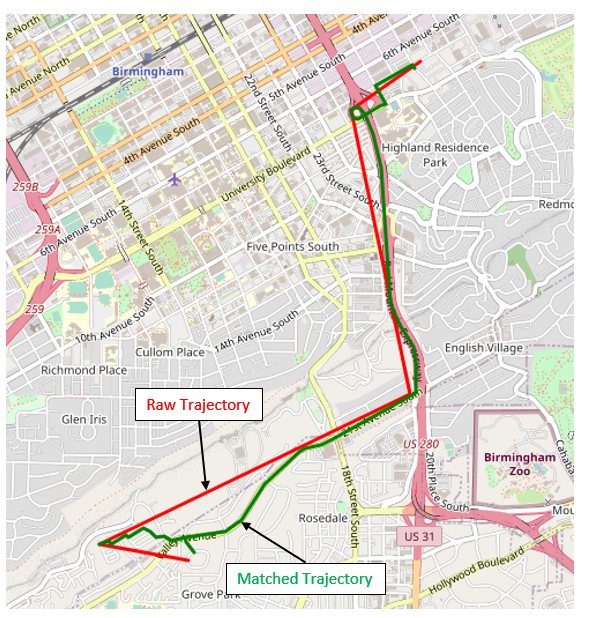

# Install Fast map matching* (FMM) using Google Colab + Real Example
It seems that installing FMM locally either on Windows or Mac is not straight forward. An easy alternative is using Google Colab! 

A complete example can be found here: 

_Example.ipynb)

  

*Can Yang & Gyozo Gidofalvi (2018) Fast map matching, an algorithm
integrating hidden Markov model with precomputation, International Journal of Geographical Information Science, 32:3, 547-570, DOI: 10.1080/13658816.2017.1400548

https://fmm-wiki.github.io/

